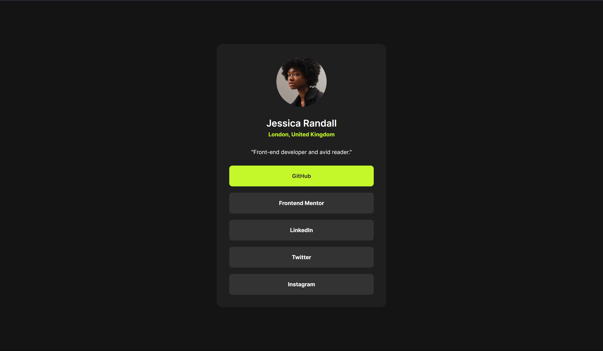

# Frontend Mentor - Social links profile solution

This is a solution to the [Social links profile challenge on Frontend Mentor](https://www.frontendmentor.io/challenges/social-links-profile-UG32l9m6dQ). Frontend Mentor challenges help you improve your coding skills by building realistic projects. 

## Table of contents

- [Overview](#overview)
  - [The challenge](#the-challenge)
  - [Screenshot](#screenshot)
  - [Links](#links)
- [My process](#my-process)
  - [Built with](#built-with)
  - [What I learned](#what-i-learned)
  - [Continued development](#continued-development)
  - [Useful resources](#useful-resources)
- [Author](#author)

## Overview

### The challenge

Users should be able to:

- See hover and focus states for all interactive elements on the page

### Screenshot




### Links

- Solution URL: [GitHub](https://your-solution-url.com)
- Live Site URL: [Add live site URL here](https://your-live-site-url.com)

## My process

### Built with

- Semantic HTML5 markup
- CSS custom properties
- Flexbox
- CSS Grid

### What I learned

Using this project to recap what I have learned. 
Learned about :root selector and it helped to make styling easier.

```css
:root {
    --clr-green: hsl(75, 94%, 57%);
    --clr-white: hsl(0, 0%, 100%);
    --clr-grey: hsl(0, 0%, 20%);
    --clr-dark-grey: hsl(0, 0%, 12%);
    --clr-off-black: hsl(0, 0%, 8%);

    --ff-base: 'Inter-Variable';
    --fw-regular: 400;
    --fw-semibold: 600;
    --fw-bold: 700;
}
```

### Continued development

Need to learn more about sizing properties (em, rem, vh, vw, px) and responsive layouts.

### Useful resources

- [W3Schools](https://www.w3schools.com/css/default.asp) - This helped me to understand CSS a bit better.


## Author

- Frontend Mentor - [@rawrisotto](https://www.frontendmentor.io/profile/rawrisotto)